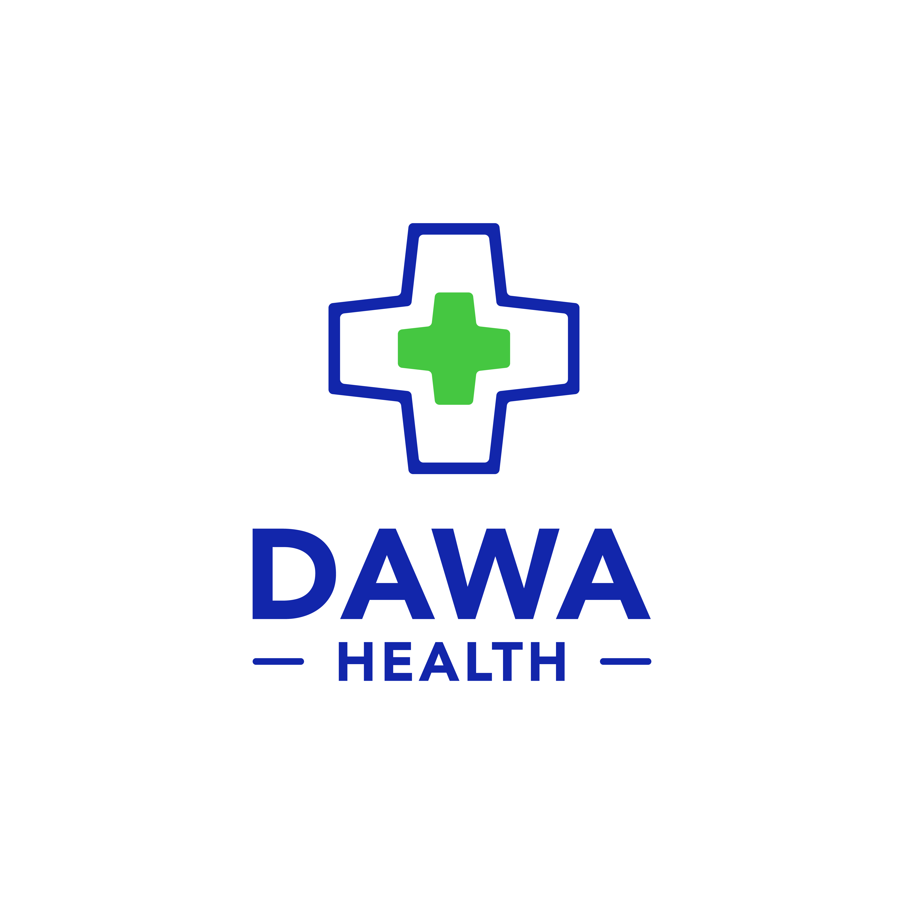

# Dawa Clinician Documentation

Dawa Clinician is the clinician-facing app in the Dawa Health ecosystem. I built it to support patient management, maternal health workflows, cervical cancer screening, AI-assisted clinical review, and device-assisted screening workflows from one place.

This documentation is written as a GitBook-ready project handbook. It explains what has been built, what changed during the Firebase to Supabase migration, how the current app is structured, and where the project still needs review before production clinical use.

## What The App Does

- Manages patient records through the `mother`, `first_encounter`, `encounter`, `doctor`, `clinic`, `parity`, and `appointments` data model.
- Supports a newer patient details view where I can open a patient, start a CaCx screening, and review previous CaCx results.
- Runs a CaCx image workflow that can send an image to a local Raspberry Pi or Arduino-style device service.
- Saves CaCx screening results to Supabase through the `cacx_screening_results` table when online, and queues the result locally when the app cannot reach Supabase.
- Supports an online Hugging Face/Gradio second-opinion path for CaCx when the primary device path fails or needs review.
- Includes offline session and cached data support so a previously logged-in user can continue using cached parts of the app when Supabase is unavailable.
- Includes quick-access clinical modules for CaCx, ultrasound, HemoNix, CT Scan, and BP Monitor.
- Includes an ultrasound module with image upload/capture and a Supabase Edge Function for Gemini-backed image review when configured.
- Includes a BP Monitor screen that interprets systolic/diastolic readings with age, pregnancy, and chronic-risk context.

## Current Status

The app is actively being upgraded. The Firebase-to-Supabase move is substantially implemented in the app code, and the branch `ui/brand-blue-refresh` contains the latest confirmed development history before this documentation branch. Some features are production-oriented, while others are still demo, local-state, or partially wired.

The most important production areas still needing review are Supabase RLS/security, live migration verification, clinical validation of AI recommendations, screenshot coverage, hardware/device reliability, and full offline sync behavior.

## Quick Links

- [Firebase to Supabase](firebase-to-supabase.md)
- [Supabase Migration](supabase-migration.md)
- [CaCx Analysis](cacx-analysis.md)
- [Arduino Device Connection](arduino-device-connection.md)
- [Offline Mode](offline-mode.md)
- [Completed Tasks](completed-tasks.md)
- [Known Issues](known-issues.md)

## Note From Samuel

I wanted this documentation to read like a real project handoff, not a generic README. The goal is that another developer, partner, or reviewer can open this GitBook and understand what I changed, why it matters, how the main flows work, and what still needs attention before the app is connected to more clinics, devices, and production health workflows.
