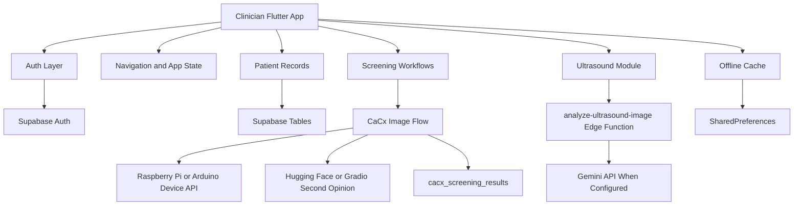

# Architecture

The app is layered around a Flutter frontend, FlutterFlow-style record models, a Supabase backend, and optional AI/device services.

## Frontend Layer

The frontend is Flutter/Dart. It uses FlutterFlow-generated structure, `go_router`, `provider`, Material widgets, custom Dawa design tokens, and app-specific screens under `lib/application`.

## State And Navigation

Navigation is handled in `lib/flutter_flow/nav/nav.dart`. The router protects authenticated routes and redirects unauthenticated users to `/login`. App-wide persisted state is managed in `lib/app_state.dart`.

## Auth Layer

The generated auth folder is still named `firebase_auth`, but confirmed code paths now call Supabase Auth. `FirebaseAuthManager` wraps sign-in, sign-up, reset password, OAuth, OTP, sign-out, delete user, and offline cached sign-in behavior.

## Backend Layer

The app initializes Supabase in `lib/main.dart` through `lib/backend/supabase/supabase_config.dart`. Database calls use `lib/backend/supabase/supabase_firestore_compat.dart`, which translates Firestore-like reads/writes into Supabase table operations.

## AI And Device Layer

CaCx has two analysis directions:

- Primary device route: local HTTP API at `/health` and `/upload/cervical`.
- Online second opinion: Hugging Face/Gradio API from the client code, plus a Supabase Edge Function named `analyze-via-image` that is present but needs token/model configuration.

Ultrasound uses the `analyze-ultrasound-image` Edge Function and can call Gemini when `GEMINI_API_KEY` is configured.

## Offline Layer

Offline behavior is built from:

- `OfflineAuthCache` for cached login identity.
- `SupabaseOfflineCache` for cached query/document rows.
- `OfflineConnectivityService` for internet, Supabase, and device reachability checks.
- `OfflineStatusScope` for the visible offline banner.

This is meaningful offline support, but it still needs field testing and stronger sync behavior before I would call it production-complete.
