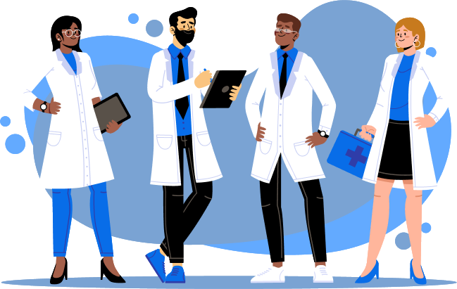
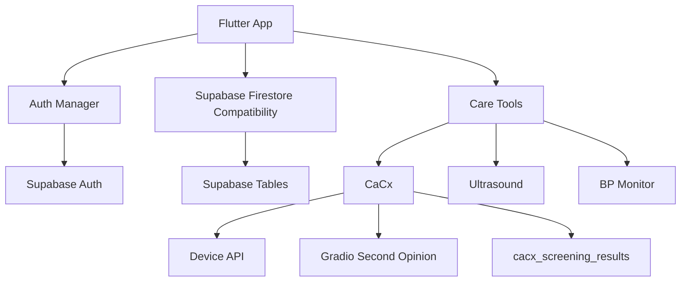
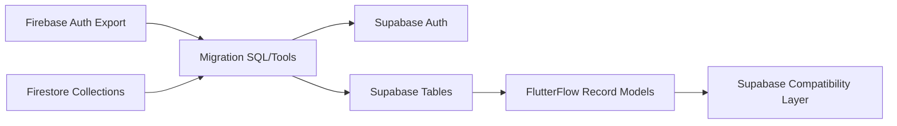
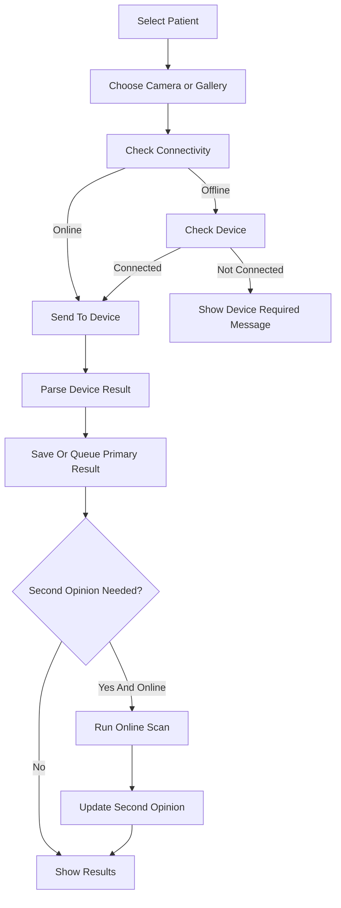
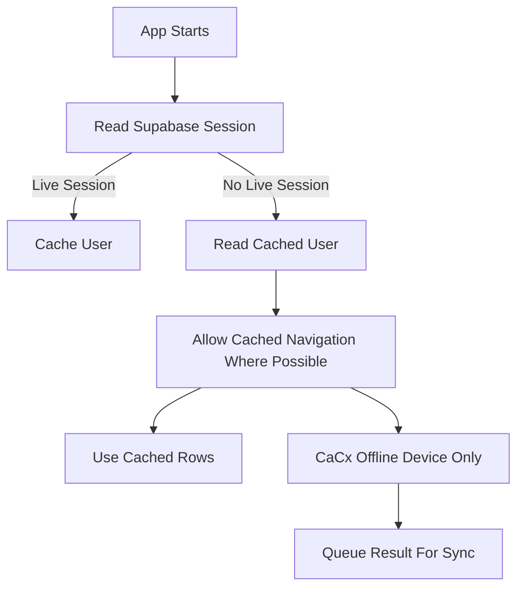
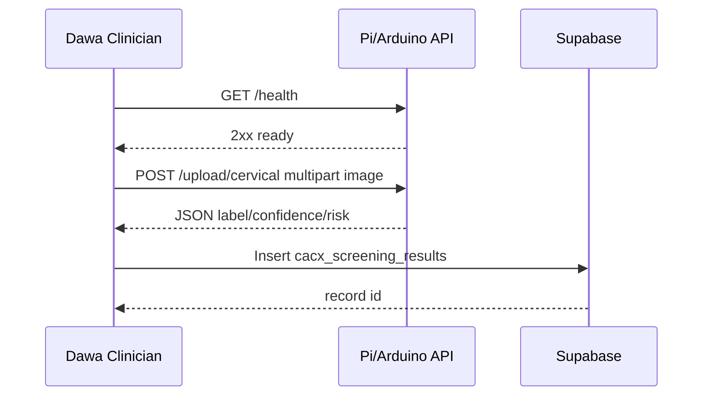

# Screenshots And Visuals

I found app visual assets in the repository, but I did not find real captured UI screenshots already committed. I copied only confirmed local assets into this GitBook folder and added diagram coverage with Mermaid.

## Confirmed Visual Assets

Caption: Existing Dawa Health logo asset copied from `assets/images/Logos-06.png`.

Caption: Existing clinician illustration copied from `assets/images/doctor_graphic.png`.

## Screenshot Capture TODO

Real screenshots still need to be captured for:

- Login screen.
- Home/dashboard.
- Patient list.
- Patient details.
- Add screening flow.
- CaCx image source modal.
- CaCx analysis progress.
- CaCx results page.
- Clinical recommendations card.
- Screening history detail modal.
- Offline banner.
- Device unavailable state.
- Ultrasound dashboard.
- BP Monitor interpretation screen.

## App Architecture Diagram

## Firebase To Supabase Migration Flow

## CaCx Flow

## Offline Mode Flow

## Arduino / Device Connection Flow

